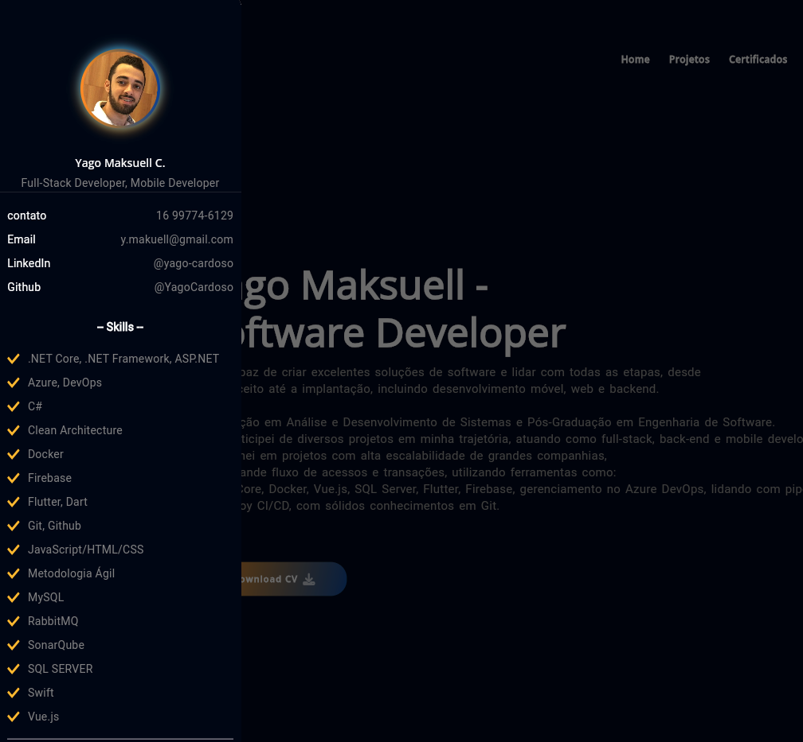
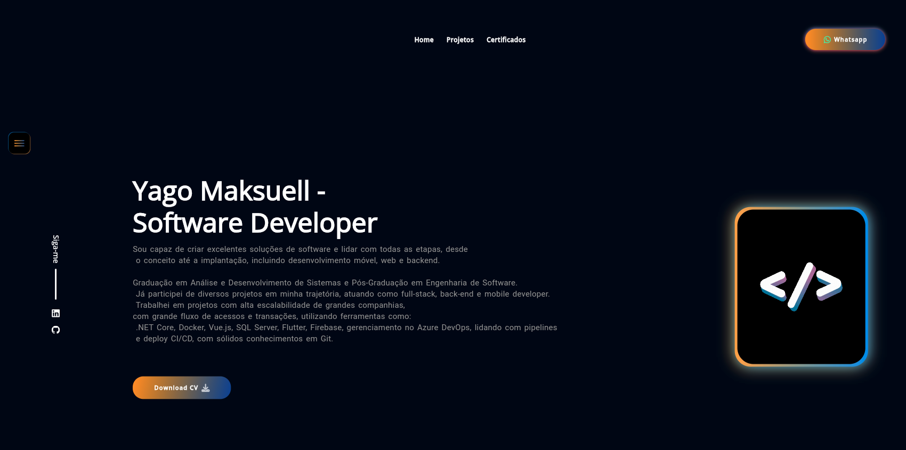

# Flutter Web Portfolio






Este é um projeto de portfólio desenvolvido com Flutter Web. O objetivo deste projeto é apresentar minhas habilidades, projetos e certificações em um formato atrativo e interativo.

## Visão Geral

O portfólio inclui as seguintes seções:

- **Home**: Uma visão geral sobre mim e minhas habilidades.
- **Projetos**: Uma lista dos meus projetos recentes com detalhes sobre cada um.
- **Certificações**: Minhas certificações profissionais.

## Estrutura do Projeto

O projeto segue a arquitetura MVVM (Model-View-ViewModel) com o uso de GetX para gerenciamento de estado e injeção de dependências. A estrutura do projeto é a seguinte:

- **Model**: Contém as classes de modelo que representam os dados.
- **View**: Contém a interface do usuário.
- **ViewModel**: Contém a lógica de apresentação e manipulação de dados para serem exibidos na View.
- **getx_controllers**: Contém os controladores específicos do GetX que gerenciam o estado e as interações das Views.
- **res**: Contém recursos como strings, cores e estilos.
- **main.dart**: Ponto de entrada do aplicativo.

## Tecnologias Utilizadas

- **Flutter**: Framework para desenvolvimento de interfaces de usuário.
- **GetX**: Gerenciamento de estado e injeção de dependências.
- **Google Fonts**: Uso de fontes do Google.
- **Flutter SVG**: Manipulação de imagens SVG.
- **Photo View**: Visualização de fotos.
- **URL Launcher**: Abertura de URLs.
- **Font Awesome Flutter**: Ícones do FontAwesome.

## Instalação

1. Certifique-se de ter o Flutter SDK instalado. Para instruções, visite [Flutter.dev](https://flutter.dev).
2. Clone este repositório:
   ```bash
   git clone https://github.com/seu-usuario/flutter_web_portfolio.git
   ```
3. Navegue até o diretório do projeto:
   ```bash
   cd flutter_web_portfolio
   ```
4. Instale as dependências:
   ```bash
   flutter pub get
   ```

## Executando o Projeto

Para executar o projeto, utilize o comando:
```bash
flutter run -d chrome
```

### Contribuições

Contribuições são bem-vindas! Sinta-se à vontade para abrir uma issue ou um pull request.

### Licença

